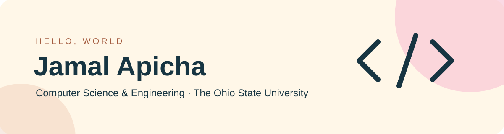

  
  
  

  

---

### 👨‍💻 About Me

Hi, I'm **Jamal Apicha**, a **Computer Science and Engineering student at The Ohio State University**.

My projects span web development and software engineering coursework, from React interfaces to Java applications.

🛠️ **A few things I've built:**

- **[Memories](https://github.com/jamalmohadinho/memories)** — a full-stack photo-sharing app for capturing personal moments with images, captions, and tags. Users can create, edit, delete, and like posts, with a React and Material UI frontend, Redux state management, and a Node.js/Express API backed by MongoDB.
- **[Split the Bill](https://github.com/jamalmohadinho/split-the-bill)** — a shared trip expense tracker that helps groups organize travel costs in one place. Users can sign up, manage trips and participants, and record expenses with amounts, categories, dates, and who paid. Built with Ruby on Rails and SQLite, the app connects users, trips, and expenses through a relational data model.
- **[React Movie App](https://github.com/jamalmohadinho/React_Movie-App)** — a movie discovery app for browsing popular titles and searching for your next watch. Built with React and Vite, it integrates movie API data into a responsive interface with poster cards, loading indicators, and error handling, demonstrating API integration and asynchronous UI updates.
- **[Meme Generator](https://github.com/jamalmohadinho/Meme-Generator-Project)** — an interactive app that turns an image URL and custom top and bottom captions into a meme. Users can add multiple memes to the page and remove individual creations with a click. Built with HTML, CSS, and JavaScript to practice form handling, event delegation, and dynamic DOM updates.
- **[My Portfolio](https://github.com/jamalmohadinho/jamal-apicha-portfolio)** — a responsive personal website showcasing my projects, technical skills, experience, and education. Built with React, Vite, and Tailwind CSS, it includes day and night themes, keyboard-accessible navigation, interactive skills tabs, and resume access, with content organized for easy updates.

🤝 **Let's connect:** find me on [LinkedIn](https://www.linkedin.com/in/jamalapicha) or explore my [GitHub repositories](https://github.com/jamalmohadinho?tab=repositories).

 

---

### 💻 Technologies & Tools

**Programming Languages**

  
  
  
  
  

**Frontend**

  
  
  

**Workflow & APIs**

  
  
  

